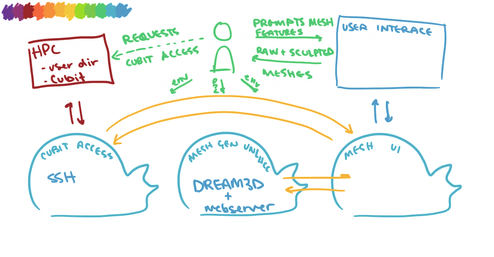

# MURMUR
**M**esh Comp**U**ting **R**e**M**ote A**U**tomatic Wo**R**kflow

**MURMUR** is a workflow automation tool for simplifying tasks related to the generation of multi-grained meshes for simulations, especially those using the MOOSE framework. It combines the capabilities of DREAM3D and Cubit.

## Prerequisites
- Docker and Docker Compose installed. On Mac and Windows, these come bundled with [Docker Desktop](https://www.docker.com/products/docker-desktop/)
- An INL HPC account
- Access to the Cubit CLI Library running on a remote server accessible via SSH (contact hpcsupport@inl.gov and ask for a Cubit license on your HPC account)

## Installation
1. Clone this repository
1. Rename the `.env-sample` files in each subdirectory (`cubit_access`, `mesh_gen_unlhcc`, and `mesh_ui`) to `.env` and set missing values.
1. Make sure Docker is running
1. Open a terminal session in this directory
1. Run `docker compose build`
1. Run `docker compose up`
1. Open a browser and navigate to `http://localhost:6767`

## Diagram
